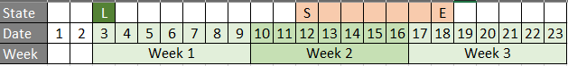
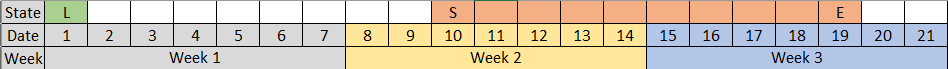
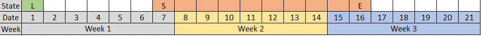
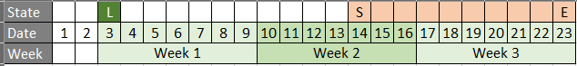

```{r setup, include=FALSE}
knitr::opts_chunk$set(echo = TRUE)
```

## Objective

Seperate the logic by initiate case scenarios

```{r lib}
library(lubridate)
```

Initialize launch date for HS

```{r init_var}
launch_date <- ymd("2019-01-03")
```

## Case 1 : 7 Days normal


Remark :

* L : Launch date
* S : Start date
* E : End date

Age Week calculation
```{r}
start_date <- ymd("2019-01-12")
end_date <- ymd("2019-01-18")

# Calculate age week
w_start <- ceiling((as.numeric(start_date - launch_date) + 1)/7)
w_end <- ceiling((as.numeric(end_date - launch_date) + 1)/7)

print(paste("w_start :", w_start))
print(paste("w_end :", w_end))
```

Week fraction calculation
```{r}
frac_start_tmp <- as.numeric(start_date - launch_date)  %% 7
frac_start <- 7 - frac_start_tmp
frac_end <- ((as.numeric(end_date - launch_date) + 1) %% 7)

paste("frac_start_tmp :", frac_start_tmp)
paste("frac_start :", frac_start)
paste("frac_end :", frac_end)
```

> `(frac_start/7)*w_start + (frac_end/7)*w_end`

## Case 2 : 10 Days normal


Age Week calculation
```{r}
start_date <- ymd("2019-01-12")
end_date <- ymd("2019-01-21")

# Calculate age week
w_start <- ceiling((as.numeric(start_date - launch_date) + 1)/7)
w_end <- ceiling((as.numeric(end_date - launch_date) + 1)/7)

print(paste("w_start :", w_start))
print(paste("w_end :", w_end))
```

Week fraction calculation
```{r}
frac_start_tmp <- as.numeric(start_date - launch_date)  %% 7
frac_start <- 7 - frac_start_tmp
frac_end <- ((as.numeric(end_date - launch_date) + 1) %% 7)

paste("frac_start_tmp :", frac_start_tmp)
paste("frac_start :", frac_start)
paste("frac_end :", frac_end)
```

> `(frac_start/7)*w_start + (frac_end/7)*w_end`

## Case 3 : 7 Days but fraction start = 0

It's automatically made fraction end = 0


Age Week calculation
```{r}
start_date <- ymd("2019-01-10")
end_date <- ymd("2019-01-16")

# Calculate age week
w_start <- ceiling((as.numeric(start_date - launch_date) + 1)/7)
w_end <- ceiling((as.numeric(end_date - launch_date) + 1)/7)

print(paste("w_start :", w_start))
print(paste("w_end :", w_end))
```

Week fraction calculation
```{r}
frac_start_tmp <- as.numeric(start_date - launch_date)  %% 7
frac_start <- 7 - frac_start_tmp
frac_end <- ((as.numeric(end_date - launch_date) + 1) %% 7)

paste("frac_start_tmp :", frac_start_tmp)
paste("frac_start :", frac_start)
paste("frac_end :", frac_end)
```

> `(frac_start/7)*w_start + (frac_end/7)*w_end`

## Case 4 : 10 Days but fraction start = 0


Age Week calculation
```{r}
start_date <- ymd("2019-01-10")
end_date <- ymd("2019-01-19")

# Calculate age week
w_start <- ceiling((as.numeric(start_date - launch_date) + 1)/7)
w_end <- ceiling((as.numeric(end_date - launch_date) + 1)/7)

print(paste("w_start :", w_start))
print(paste("w_end :", w_end))
```

Week fraction calculation
```{r}
frac_start <- (7 - (day(start_date) %% 7)) +1
frac_end <- day(end_date) %% 7

frac_start_tmp <- as.numeric(start_date - launch_date)  %% 7
frac_start <- 7 - frac_start_tmp
frac_end <- ((as.numeric(end_date - launch_date) + 1) %% 7)

paste("frac_start_tmp :", frac_start_tmp)
paste("frac_start :", frac_start)
paste("frac_end :", frac_end)
```

> `(frac_start/7)*w_start + (frac_end/7)*w_end`

## Case 5 : 10 Days but fraction end = 0


Age Week calculation
```{r}
start_date <- ymd("2019-01-14")
end_date <- ymd("2019-01-23")

# Calculate age week
w_start <- ceiling((as.numeric(start_date - launch_date) + 1)/7)
w_end <- ceiling((as.numeric(end_date - launch_date) + 1)/7)

print(paste("w_start :", w_start))
print(paste("w_end :", w_end))
```

Week fraction calculation
```{r}
frac_start <- (7 - (day(start_date) %% 7)) +1
frac_end <- day(end_date) %% 7

frac_start_tmp <- as.numeric(start_date - launch_date)  %% 7
frac_start <- 7 - frac_start_tmp
frac_end <- ((as.numeric(end_date - launch_date) + 1) %% 7)

paste("frac_start_tmp :", frac_start_tmp)
paste("frac_start :", frac_start)
paste("frac_end :", frac_end)
```

> `ifelse(frac_end == 0 & frac_start_tmp != 0,7,frac_end)`

> `(frac_start/7)*w_start + (frac_end/7)*w_end`

