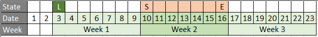

```{r setup, include=FALSE}
knitr::opts_chunk$set(echo = TRUE)
```

## Objective

Seperate the logic by initiate case scenarios

```{r lib}
library(lubridate)
```

Initialize launch date for HS

```{r init_var}
launch_date <- ymd("2019-01-01")
```

## Case 1 : 7 Days normal


Remark :

* L : Launch date
* S : Start date
* E : End date

Age Week calculation
```{r}
start_date <- ymd("2019-01-10")
end_date <- ymd("2019-01-16")

# Calculate age week
w_start <- ceiling(as.numeric(start_date - launch_date)/7)
w_end <- ceiling(as.numeric(end_date - launch_date)/7)

print(paste("w_start :", w_start))
print(paste("w_end :", w_end))
```

Week fraction calculation
```{r}
# Minus 7 to get toward side and + 1 to get the begin date
frac_start <- (7 - (day(start_date) %% 7)) +1
frac_end <- day(end_date) %% 7

paste("frac_start :", frac_start)
paste("frac_end :", frac_end)
```

> `(frac_start/7)*w_start + (frac_end/7)*w_end`

## Case 2 : 10 Days normal


Age Week calculation
```{r}
start_date <- ymd("2019-01-10")
end_date <- ymd("2019-01-19")

# Calculate age week
w_start <- ceiling(as.numeric(start_date - launch_date)/7)
w_end <- ceiling(as.numeric(end_date - launch_date)/7)

print(paste("w_start :", w_start))
print(paste("w_end :", w_end))
```

Week fraction calculation
```{r}
frac_start <- (7 - (day(start_date) %% 7)) +1
frac_end <- day(end_date) %% 7

paste("frac_start :", frac_start)
paste("frac_end :", frac_end)
```

> `(frac_start/7)*w_start + (frac_end/7)*w_end`

## Case 3 : 7 Days but fraction start = 0


Age Week calculation
```{r}
start_date <- ymd("2019-01-7")
end_date <- ymd("2019-01-13")

# Calculate age week
w_start <- ceiling(as.numeric(start_date - launch_date)/7)
w_end <- ceiling(as.numeric(end_date - launch_date)/7)

print(paste("w_start :", w_start))
print(paste("w_end :", w_end))
```

Week fraction calculation
```{r}
frac_start <- (7 - (day(start_date) %% 7)) +1
frac_end <- day(end_date) %% 7

paste("frac_start :", frac_start)
paste("frac_end :", frac_end)
```

> `ifelse(frac_start == 8,1,frac_start)`

> `(frac_start/7)*w_start + (frac_end/7)*w_end`

## Case 4 : 10 Days but fraction start = 0


Age Week calculation
```{r}
start_date <- ymd("2019-01-7")
end_date <- ymd("2019-01-16")

# Calculate age week
w_start <- ceiling(as.numeric(start_date - launch_date)/7)
w_end <- ceiling(as.numeric(end_date - launch_date)/7)

print(paste("w_start :", w_start))
print(paste("w_end :", w_end))
```

Week fraction calculation
```{r}
frac_start <- (7 - (day(start_date) %% 7)) +1
frac_end <- day(end_date) %% 7

paste("frac_start :", frac_start)
paste("frac_end :", frac_end)
```

> `ifelse(frac_start == 8,1,frac_start)`

> `w_between = ifelse((w_end - w_start) > 1, w_start + 1, NA)`

> `(frac_start/7)*w_start + w_between + (frac_end/7)*w_end`

## Case 5 : 7 Days but fraction start and fraction end = 0


Age Week calculation
```{r}
start_date <- ymd("2019-01-8")
end_date <- ymd("2019-01-14")

# Calculate age week
w_start <- ceiling(as.numeric(start_date - launch_date)/7)
w_end <- ceiling(as.numeric(end_date - launch_date)/7)

print(paste("w_start :", w_start))
print(paste("w_end :", w_end))
```

Week fraction calculation
```{r}
frac_start <- (7 - (day(start_date) %% 7)) +1
frac_end <- day(end_date) %% 7

paste("frac_start :", frac_start)
paste("frac_end :", frac_end)
```

> `ifelse(frac_start == 7,0,frac_start)`

> `ifelse(frac_end == 0,7,frac_end)`

> `w_between = ifelse((w_end - w_start) > 1, w_start + 1, NA)`

> `(frac_start/7)*w_start + w_between + (frac_end/7)*w_end`

## Case 6 : 10 Days but fraction end = 0


Age Week calculation
```{r}
start_date <- ymd("2019-01-5")
end_date <- ymd("2019-01-14")

# Calculate age week
w_start <- ceiling(as.numeric(start_date - launch_date)/7)
w_end <- ceiling(as.numeric(end_date - launch_date)/7)

print(paste("w_start :", w_start))
print(paste("w_end :", w_end))
```

Week fraction calculation
```{r}
frac_start <- (7 - (day(start_date) %% 7)) +1
frac_end <- day(end_date) %% 7

paste("frac_start :", frac_start)
paste("frac_end :", frac_end)
```

> `ifelse(frac_end == 0,7,frac_end)`

> `w_between = ifelse((w_end - w_start) > 1, w_start + 1, NA)`

> `(frac_start/7)*w_start + w_between + (frac_end/7)*w_end`

